  

 

  
  <!-- Primary Professional Links -->
  
  
  
  
  
   
  
  <!-- Social Media Links -->
  
  
  

 

<!-- Dynamic Typing Animation -->
<h1 align="center">
  
</h1>

<!-- Profile Statistics -->

  
  
  

  
  
  

---

## 👨‍💻 About Me

I'm **Md. Toyob Uddin Hridoy** — **Hridoy** — a **Software Engineer in R&D at Compliance BD Ltd**, where I turn business operations into **autonomous digital systems**.

My foundation is **full-stack MERN engineering** — not tutorials, but multi-role platforms with real payments, deployed and running in production. My edge is **AI automation**: **n8n workflows**, **LLM-powered autonomous agents (Hermes)**, and **API orchestration** that let software handle the repetitive work — while humans stay in control of every decision that matters. **BSc in Computer Science & Engineering**, Port City International University (2022-2026).

**🎯 Current Mission:**

- 🤖 Building **Digital Hridoy** — a cloud-operated autonomous counterpart that works while I sleep
- ⚡ Shipping **production AI agents** & n8n automations for real business processes
- 🏗️ Turning prototypes into **observable, maintainable production systems**
- 📡 Sharpening **TypeScript, Next.js** & advanced backend architecture

**🔗 Explore My Work:** **[md-toyob-hridoy-portfolio.vercel.app](https://md-toyob-hridoy-portfolio.vercel.app/)**

---

## 🛠️ Tech Stack

### AI & Automation 🤖

### Frontend Development 🎨

### Backend Development ⚙️

### Tools & Platforms 🔧

### Programming Languages 💻

---

## 💼 What I Deliver

  

---

## 📊 GitHub Activity

<!-- Fully self-hosted telemetry: generated by scripts/generate-telemetry.mjs
     and refreshed nightly by .github/workflows/update-telemetry.yml.
     No third-party widget services — nothing here can break. -->

  
  
  
  
  
  Self-hosted telemetry — rebuilt nightly by a <a href="./.github/workflows/update-telemetry.yml">GitHub Action</a> from live data. No third-party widgets, nothing to break.
  

---

## 🎯 Mission Parameters

- 🛰️ **Primary directive** — turn business operations into **autonomous digital systems**
- ⚙️ **Rules of engagement** — ship **production-grade** systems: observable, recoverable, maintainable
- 🤝 **Alliances** — open to teams & founders building **serious products** (**remote-first** 🌍, flexible)
- 🧠 **Human protocol** — automate the repetitive, **never the judgment**
- 📈 **Growth loop** — every project compounds: full-stack foundation → AI automation edge

---

## 📬 Let's Connect!

  
  <h3>🚀 Open to Full-Time & Remote Opportunities</h3>
  
  

    I'm actively seeking positions where I can contribute to meaningful projects, 
    collaborate with talented teams, and grow as a professional developer.
  

   

  <table>
  <tr>
    <td align="center">
      
    </td>
    <td align="center">
      
    </td>
    <td align="center">
      
    </td>
  </tr>
  <tr>
    <td align="center">
      
    </td>
    <td align="center">
      
    </td>
    <td align="center">
      
    </td>
  </tr>
  </table>

   

  

    <b>📍 Location:</b> Dhaka, Bangladesh 
    <b>💼 Status:</b> Open to Work 
    <b>🌍 Preference:</b> Remote-First | Flexible 
    <b>⚡ Response Time:</b> Fast & Professional
  

---

  

   

  
  
  
  

    

  

